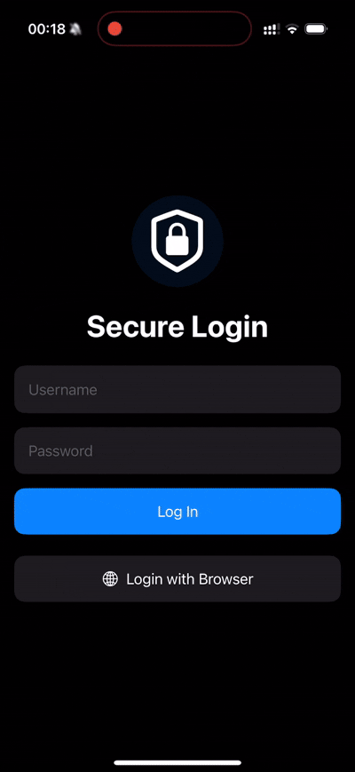

## 🔐 SecureAuthKit

SecureAuthKit is a lightweight, secure, privacy-conscious Swift package that enables mobile apps to perform robust authentication using modern OAuth2.0 standards, biometric authentication, and secure token storage — including Secure Enclave integration.

---

### 🚀 Features

- ✅ Authorization Code Flow with PKCE (ASWebAuthenticationSession)
- ✅ Biometric authentication (Face ID / Touch ID / Passcode fallback)
- ✅ OAuth2 + OpenID Connect (id_token support)
- ✅ Username/password (ROPC) login for trusted apps
- ✅ Secure token storage using Keychain
- ✅ DPoP (Demonstration of Proof-of-Possession) support
- ✅ Secure Enclave-backed keypair generation
- ✅ Automatic token refresh
- ✅ Auth state tracking and streaming via AsyncSequence
- ✅ Fully testable, modular architecture
- ✅ Example SwiftUI App integration

---

### 📱 Example SwiftUI App
SecureAuthKit comes with a working SwiftUI demo app using `SecureAuthClient`.

<p align="center">
  
</p>

---

### ✨ Quick Integration

Add SecureAuthKit to your project:

```swift
.package(url: "https://github.com/hkothari90/SecureAuthKit.git", from: "1.0.0")
```

---

### AuthViewModel Sample:

```swift
@MainActor
final class AuthViewModel: ObservableObject {
    @Published var authState: AuthState = .unauthenticated
    @Published var error: SecureAuthError?
    
    private let client: SecureAuthClient
    private var eventStreamTask: Task<Void, Never>?
    
    /// Initializes the view model with a `SecureAuthClient` instance.
    init(client: SecureAuthClient) {
        self.client = client
        bindLifecycleEvents()
    }
    
    deinit {
        eventStreamTask?.cancel()
    }
    
    /// Performs login using username and password.
    /// Saves user’s biometric preference on success.
    func loginWithCredentials(username: String, password: String) {
        Task {
            do {
                try await client.loginWithCredentials(username: username, password: password)
            } catch {
                self.authState = .failed(error as? SecureAuthError ?? .invalidCredentials)
            }
        }
    }
    
    /// Initiates browser-based login using OAuth2 Authorization Code Flow.
    /// Saves biometric preference on success.
    func loginWithBrowser() {
        Task {
            do {
                try await client.loginWithBrowser()
            } catch {
                self.authState = .failed(error as? SecureAuthError ?? .invalidCallback)
            }
        }
    }
    
    /// Triggers biometric authentication if available.
    func authenticateWithBiometrics() {
        Task {
            do {
                try await client.authenticateWithBiometrics()
            } catch {
                self.authState = .failed(error as? SecureAuthError ?? .biometricFailure)
            }
        }
    }
    
    /// Logs out the user and removes biometric preference.
    func logout() {
        Task {
            try? await client.logout()
        }
    }
    
    /// Subscribes to lifecycle events from SecureAuthClient and updates UI state accordingly.
    private func bindLifecycleEvents() {
        eventStreamTask = Task {
            for await event in await client.lifecycleEvents() {
                await MainActor.run {
                    switch event {
                    case .loading:
                        ...
                    case .authenticated(let token):
                        self.authState = .authenticated(token)
                    case .unauthenticated:
                        self.authState = .unauthenticated
                    case .failed(let error):
                        self.authState = .failed(error)
                    }
                }
            }
        }
    }
}
```

---

### 🔒 Security Recommendations

- Always prefer **Authorization Code Flow with PKCE**
- Use **ROPC only** for internal apps with full control over backend and frontend
- Store biometric opt-in securely
- Enable device-based certificate pinning for production environments
- Use Secure Enclave for any private key material (e.g., DPoP)

---

### 🛠 Technologies Used

- Swift Concurrency (`async/await`)
- Swift Actors
- Combine / AsyncStream
- Keychain Services
- LocalAuthentication
- ASWebAuthenticationSession
- OpenID Connect
- DPoP with JWT Proof Signing

---

### 🧩 Contributions

Feel free to fork, contribute or suggest improvements.

---

### 🪪 License

MIT License.
